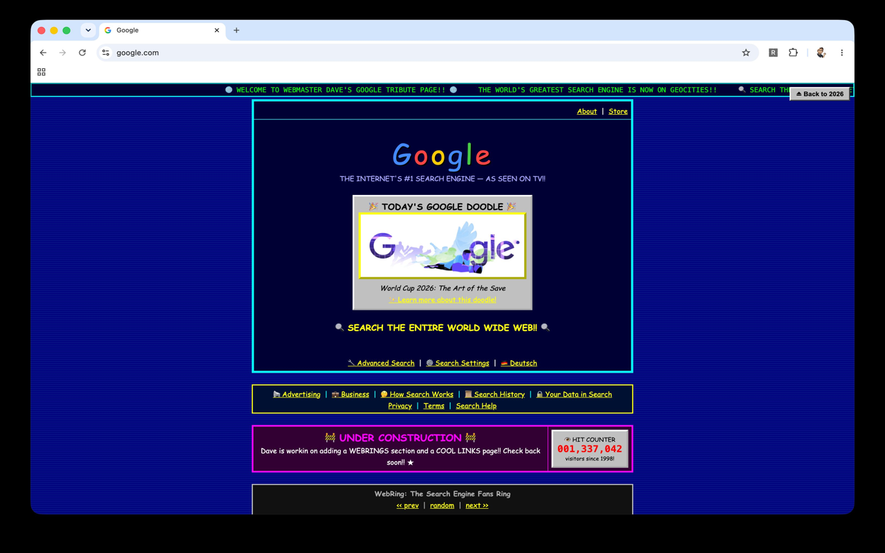

# 🌐 Retro Web — The Information Superhighway

A Chrome extension that uses Claude to rebuild **any web page** as a glorious
90s/early-2000s website: table layouts, Comic Sans, `<marquee>`, hit counters,
guestbooks, webrings — complete with a dial-up modem loading screen while the
page "downloads at 28.8 kbps".

Click a link inside a retro page and the next page gets retro-fied too.
Surf the whole web in 1998.



*google.com after Retro Web — hit counter, webring, "under construction" and
all. Click **⏏ Back to 2026** (top right) to return. No tables were harmed in
the making of this page.*

## How it works

1. A **content script** (injected only when you click Retro-fy) extracts the
   page's readable content — title, headings, paragraphs, image URLs, links —
   not its markup, so the prompt stays small.
2. A **background service worker** streams a request to the Claude API
   (`/v1/messages`, `stream: true`) with a "1998 Geocities webmaster" system
   prompt that demands period-correct design and CSS-only animation.
3. The generated HTML streams into a **sandboxed iframe** (no `allow-scripts`,
   so generated markup can never execute code; a post-stream harden pass
   strips inert active content as defense-in-depth). `contentDocument.write()`
   hands chunks to the browser's own streaming parser, so the page renders
   progressively with no re-parsing. Completed generations are cached per URL
   per model in `chrome.storage.local`; truncated ones are shown but never
   cached.

## Setup

You bring your own Anthropic API key — there is no middleman server.

1. Open `chrome://extensions`, enable **Developer mode** (top right).
2. Click **Load unpacked** and select this folder.
3. Right-click the extension icon → **Options**, paste your Anthropic API key
   (get one at [platform.claude.com](https://platform.claude.com)) and pick a
   model.
4. Visit any article-ish page, click the extension icon → **Retro-fy this
   page!!** Click **⏏ Back to 2026** to return — a **⏪ Back to 1996** button
   stays on the page so you can jump straight back (instant, served from
   cache).

### Cost

Each page generation calls the Claude API with your key. Rough cost per page:

| Model | ~Cost per page | Character |
|---|---|---|
| Claude Opus 4.8 | ~$0.15 | Best retro pages, funniest commitment to the bit |
| Claude Sonnet 4.6 | ~$0.09 | Balanced |
| Claude Haiku 4.5 | ~$0.03 | Fastest and cheapest |

Pages are cached per URL per model, so revisits are free.

## Privacy & security

- **What is sent where:** when you explicitly retro-fy a page (or follow a
  link in retro mode), the extracted text content of that page is sent
  directly from your browser to the Anthropic API using your own API key.
  Nothing is sent anywhere else; there is no telemetry, no analytics, no
  third-party server.
- **Your API key** is stored in `chrome.storage.local` on your machine and is
  only ever sent to `api.anthropic.com` (the
  `anthropic-dangerous-direct-browser-access` header enables direct
  browser-to-API calls — "dangerous" refers to embedding a key in a shipped
  product, which doesn't apply to bring-your-own-key).
- **Why `<all_urls>` permission:** retro mode follows links — after you click
  a link inside a retro page, the extension re-injects itself into the
  destination page. Chrome's `activeTab` grant dies on navigation, so
  standing host access is required for this feature.
- **Why `webNavigation` permission:** used only to time injection in
  retro-mode tabs (paint the loading screen at navigation commit, start
  generation at DOMContentLoaded). Navigation events for tabs not in retro
  mode are ignored; nothing is collected, stored, or transmitted.
- **Generated HTML can't run code:** the retro page renders inside an iframe
  sandboxed without `allow-scripts`, so model output cannot execute
  JavaScript regardless of what it contains, plus a sanitization pass as
  defense-in-depth.

## Known limitations

- SPAs that navigate via `history.pushState` don't trigger retro-mode
  re-injection yet.
- Restricted pages (`chrome://`, Chrome Web Store) can't be retro-fied.
- Generation takes ~10–60s depending on model — that's what the modem
  screen is for. It was never fast in 1998 either.

See [PLAN.md](PLAN.md) for the roadmap.

## Project layout

```
manifest.json          MV3 manifest
src/background.js      Claude API streaming client (SSE), cache, retro-mode tabs
src/content.js         Extraction, modem screen, sandboxed-iframe renderer
src/popup.html/js      Toolbar popup ("Retro-fy this page!!")
src/options.html/js    API key + model picker
scripts/smoke-test.js  Runtime smoke test (stubbed DOM/chrome APIs)
```

## Contributing

See [CONTRIBUTING.md](CONTRIBUTING.md). Short version: no build step, vanilla
JS on purpose; run `node scripts/smoke-test.js` before sending a PR.

## License

[MIT](LICENSE)
